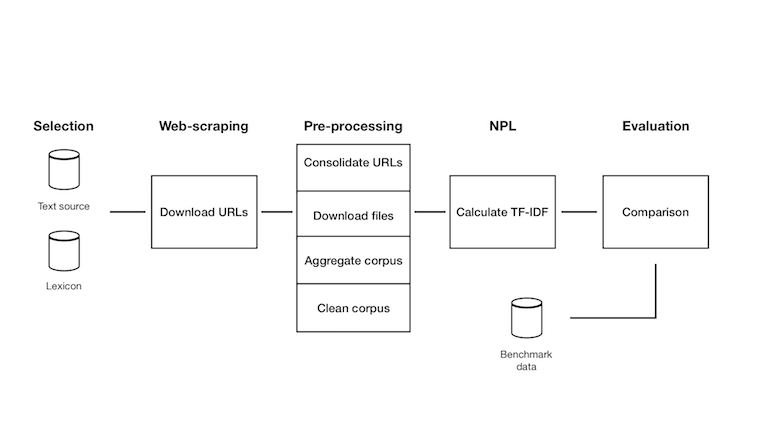

```{r setup, include=FALSE}
knitr::opts_chunk$set(echo = TRUE)

```

Getting started with text analysis can be a daunting task for researchers/practioners. <br> There are different elements of confusion: mainly, the many steps to take before the selected documents can be actually analyzed as quantitative data and the variety of functions coming from different packages, each with its own trade-offs. <br> 
The purpose of the TextMiningCrisis package is to make Natural Language Processing tasks easier, hence more accessible, reproducible and faster, consolidating the different steps into an unified framework.




There are five families of functions in the package to help you thorugh the different stages:
<ol>
  <li>Lexicon: these functions allow to create and inspect your own dictionary of expressions related to the event of interest.</li>
  <li>Text extraction: tools to download files and read (aggregate) into the global environment. </li>
  <li>Text cleaning: cleanse corpus from elements that would hinder Natural Language Processing.</li>
  <li>Term frequencies: set of functions to compute tf-idfs from the corpus.</li>
  <li> Comparison and refine: check eventual mistakes and render updating easy <li>
</ol>

#Selection
You can create your own dictionary of expressions for multiple categories.<br>
In this case, we show the keywords we created for natural disasters and conflicts:
```{r warning=FALSE}
TextMiningCrisis::lexicon() [c("Natural_disaster","Wars")]
```

#Pre-processing
##Download files
The function ```pdf_from_url``` downloads all the pdfs from a dataframe of urls into a specified directory.
Three messages can appear during the process of download:

1. name_file: succesfully downloaded
1. name_file: already downloaded
1. name_file: Error in path file


##Aggregate corpus
The function ```aggregate_corpus``` loads all the files present into a directory into a single list and cleans them.

```{r warning=FALSE,results='hide'}
# Aggregate files in docs_example directory (IMF documents for Argentina 1980-1990):

corpus <- TextMiningCrisis::aggregate_corpus("~/Desktop/Packages/TextMiningCrisis/data/docs_example", only_files = T)
```
```{r}
# Show the second page of the first document:

corpus[[1]][[2]]

```


#NPL
```run_tf``` returns from the corpus of documents a term-frequency matrix. What is it? For each of the categories in the ```lexicon``` function, counts the occurence of the selected keywords in every document and divides it by the total number of characters.<br> <br>
In this example, we want to quantify the use of words related to currency crisis and wars in documents on Argentina published by the IMF. The period our corpus cover is 1970-1980:
```{r warning=FALSE,results='hide'}


# Create a term-frequency matrix for previous corpus:

tf <-TextMiningCrisis::run_tf("~/Desktop/Packages/TextMiningCrisis/data/corpus_example.RData",keyword_list = c("Currency_crisis_severe","Wars"))

```

```{r, echo=F}
# Display matrix:
tf
```
Let's plot the two indexes:


```{r, include=FALSE}
# Load packages used in this session:

library(ggplot2)
library(tidyverse)
```

```{r fig.width=7}

# Extract year and iso3, average over documents by year:

tf_year <- tf %>% 
  mutate(year = str_extract(file,"\\d{4}")) %>%
  mutate(iso3c = str_extract(file,"[A-Z]{3}")) %>%
  group_by(iso3c,year) %>% 
  summarize_at(vars(c("Currency_crisis_severe","Wars")), mean, na.rm = TRUE) %>% 
  gather("tf_type","tf_value",Currency_crisis_severe:Wars)

# Plot:

tf_year %>% 
  ggplot(aes(year,tf_value*100,col=tf_type,group = 1)) +
  geom_line() +
  facet_wrap(~tf_type) +
  theme_bw() +
  ylab("%") +
  xlab("") +
  theme(legend.position = "none") +
  theme(axis.text.x = element_text(angle = 90, hjust = 1)) 


```

There seems to be three different waves of currency crises, in 1981,1983-1985 and 1989. In the last year of the decade the tf reaches its maximumum: 0.01\% of the documents' characters is on average devoted to currency crisis. For wars, instead, the index starts rising in 1983 and reaches its peak in 1985.


#Comparison
Now, you want to control the peak in 1989 in the tf for currency crisis.<br>
What are the exact keywords that were detected? in which context? <br>
To check, we can use the ```get_sentences``` function. 

```{r}

sentences_currency_crisis <- TextMiningCrisis::get_sentences(corpus, c("Currency_crisis_severe"))
sentences_currency_crisis[["ARG_1989-10-17_request"]]

```
Was the IMF really talking about currency crises in that year for Argentina or the lexicon we used has some issues that need to be addressed?<br>

```{r}
sentences_currency_crisis[["ARG_1989-10-17_request"]] %>% 
  select(sentence) %>% 
  slice(3) %>% 
  data.frame()

```
It is now clear that it was not a mistake and we even have additional information about the timing of the shock.
<br>
<br>


